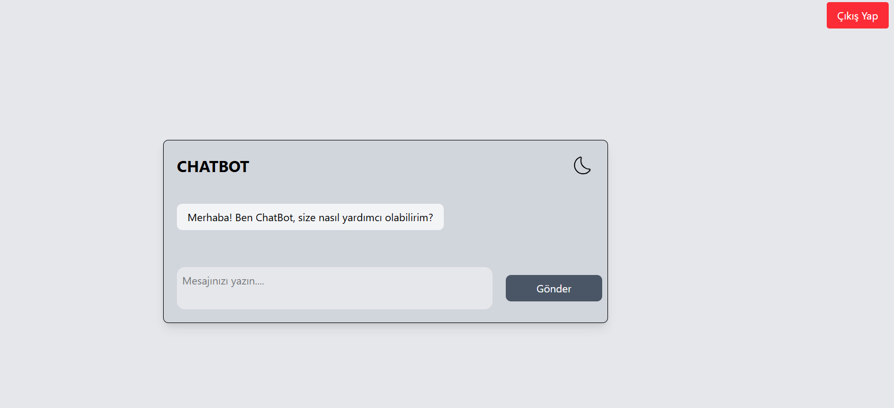
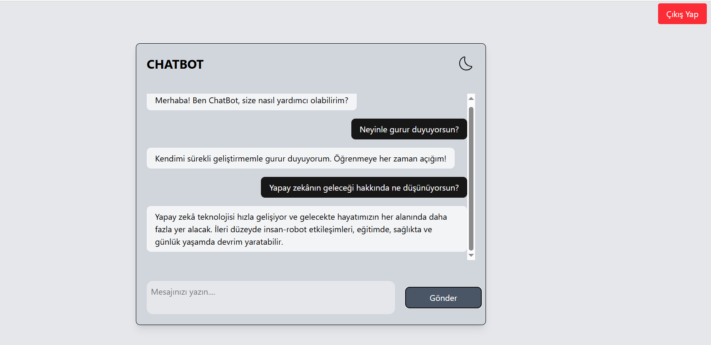

# ChatBot Uygulaması

Bu proje, kullanıcıların chatbot ile etkileşime girebileceği basit bir React uygulamasıdır. Uygulama, kullanıcıdan gelen mesajlara yanıt olarak, önceden belirlenmiş mesajları API üzerinden çekerek cevaplar sunmaktadır.

### Görsel Eklemek:




## Özellikler
- Kullanıcılar mesajlarını yazarak sohbet eder.
- Bot, kullanıcıların mesajlarına uygun yanıtlar verir.
- Gece/gündüz modu desteği.
- Basit bir giriş sistemi (çıkış yapma butonu ile).

## Kullanılan Teknolojiler
- React
- React Router
- Tailwind CSS
- React Icons
- MockAPI (Mesaj verilerini çekmek için)
- LocalStorage (Giriş durumunu yönetmek için)

## Kurulum
Bu projeyi yerel bilgisayarınızda çalıştırmak için şu adımları takip edebilirsiniz:

1. Bu repository'yi bilgisayarınıza klonlayın:
   ```bash
   git clone https://github.com/kullanici-adi/chatbot-app.git
